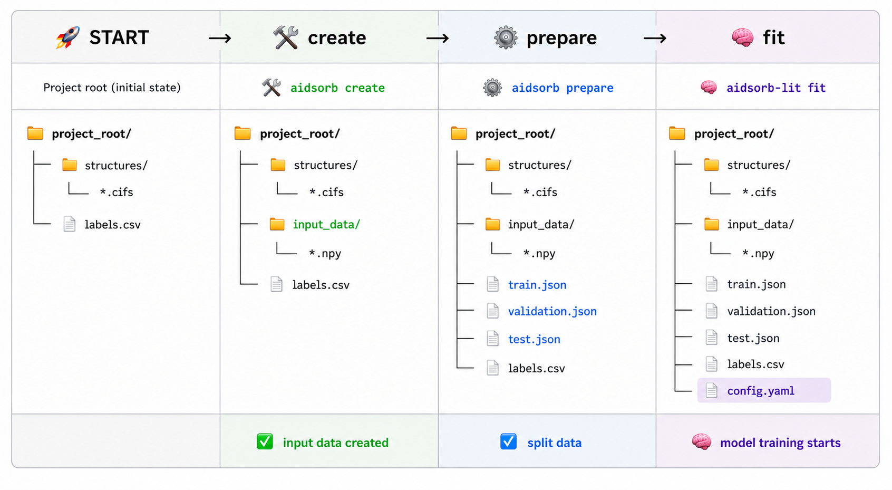

:octicon:`rocket` Getting started
=================================

.. note::
   This section introduces the framework, its core concepts, and the main
   components of its workflow. It provides a starting point for understanding
   the framework and prepares you for the complete end-to-end :ref:`tutorial`.
   For advanced usage, consult the :doc:`/api`.

Introduction
------------

At its core, |aidsorb| automates the end-to-end workflow of training deep
learning models for porous materials.

The process starts from a directory of molecular structures together with a
``labels.csv`` file containing the target properties. The structures are first
converted into one of the built-in representations. Alternatively, users can
supply their own precomputed representations stored as ``.npy`` files. The
resulting data are then split into training, validation, and test sets, after
which the entire training pipeline is orchestrated through a single ``.yaml``
configuration file.

The general workflow is illustrated below.

Representations
---------------

.. tip::
   The representations described below are built into |aidsorb|, but
   you are not limited to them. You can train models using your own
   representations, as long as they are stored as ``.npy`` files
   (see :func:`numpy.save`) in a directory.

Point clouds
^^^^^^^^^^^^

*What is a point cloud?*

   A point cloud is a *set of 3D data points*, i.e. a *set of 3D coordinates
   and (optionally) associated features*. More formally:

   .. math::
      \mathcal{P} = \{\mathbf{p}_1, \mathbf{p}_2, \dots, \mathbf{p}_N\}
      \quad
      \text{and}
      \quad
      \mathbf{p}_i \in \mathbb{R}^{3+C}

   where :math:`N` is the number of points in the point cloud and :math:`C` is
   the number of (per-point) features.

   In |aidsorb|, a point cloud is represented as a :class:`~numpy.ndarray` or
   :class:`~torch.Tensor` of shape ``(N, 3+C)``:

   .. math::
      \mathcal{P} =
      \begin{bmatrix}
         \mathbf{p}_1 \\
         \mathbf{p}_2 \\
         \vdots \\
         \mathbf{p}_N
      \end{bmatrix}
      =
      \begin{bmatrix}
         x_1 & y_1 & z_1 & f_{1}^1 & \dots & f_1^C \\
         x_2 & y_2 & z_2 & f_{2}^1 & \dots & f_2^C \\
         \vdots & \vdots & \vdots & \vdots & \ddots & \vdots \\
         x_N & y_N & z_N & f_{N}^1 & \dots & f_N^C \\
      \end{bmatrix}
         

*What is a molecular point cloud?*

   It is a point cloud where coordinates correspond to **atomic positions**,
   and features correspond to **atomic numbers and any additional information**.

   In |aidsorb|, a molecular point cloud is represented as
   :class:`~numpy.ndarray` or :class:`~torch.Tensor` of shape ``(N, 4+C)``,
   where ``N`` is the number of atoms, ``pcd[:, :3]`` are the **atomic
   coordinates**, ``pcd[:, 3]`` are the **atomic numbers** and ``pcd[:, 4:]``
   any **additional features**. If ``C == 0``, then the only features are the
   atomic numbers.

*Why molecular point clouds?*

    A fast, generic, and flexible representation that can be applied to a wide
    range of molecular and material systems. It enables deep learning directly
    from raw structural information, but typically requires more training data
    than more specialized representations.

.. raw:: html
    :file: images/pcd_plotly.html

The above point cloud represents IRMOF-1. You can hover :fa:`arrow-pointer;
fa-beat-fade` over the figure to play with it.

Energy voxels
^^^^^^^^^^^^^

*What are energy voxels?*

    It is the **voxelized potential energy surface** of the material, that is a **3D
    energy image**, representing the landscape of host-guest interactions.

    In |aidsorb|, energy voxels are represented as :class:`~numpy.ndarray` or
    :class:`~torch.Tensor` of shape ``(C, D, H, W)`` (multi-channel image) or ``(D,
    H, W)`` (single-channel image).

*Why energy voxels?*

    A physics-informed representation tailored for adsorption in porous
    materials. By explicitly encoding host–guest interaction energies, it often
    achieves good predictive performance with less training data than more
    generic representations, at the cost of reduced generality.

.. raw:: html
    :file: images/pes_plotly.html

The above energy image represents IRMOF-1. You can hover :fa:`arrow-pointer;
fa-beat-fade` over the figure to play with it.

.. _tutorial:

Tutorial
--------

This tutorial demonstrates a complete workflow using molecular point clouds.

.. tip::
    The overall workflow is essentially the same for all built-in
    and custom representations. Only the representation-specific preprocessing
    and model configuration need to be adapted.

Before starting, the following components are needed:

* A directory containing files of **molecular structures**.
* A ``.csv`` file containing the **labels of the molecular structures**.
* A ``.yaml`` **configuration file** for orchestrating the DL part.

.. note::
   You are solely responsible for these 3 components.

Data preparation
^^^^^^^^^^^^^^^^

.. rubric:: Create and store the point clouds

Assuming your molecular structures are stored under a directory named
``structures``:

.. tab-set::

    .. tab-item:: CLI

        .. code-block:: console

            $ aidsorb create points path/to/structures path/to/pcd_data --features="[en_pauling]"
            $ aidsorb create --config=config.yaml  # Recommended for reproducibility
    
    .. tab-item:: config.yaml

        .. code-block:: yaml

            dirname: 'path/to/structures'
            outname: 'path/to/pcd_data'
            features: ['en_pauling']

    .. tab-item:: Python

        .. code-block:: python

            from aidsorb.utils import pcd_from_dir

            # Add electronegativity as additional feature.
            pcd_from_dir(
                dirname='path/to/structures',
                outname='path/to/pcd_data',
                features=['en_pauling'],
            )

.. rubric:: Split point clouds into train, validation and test sets

.. tab-set::

    .. tab-item:: CLI

        .. code-block:: console

            $ aidsorb prepare path/to/pcd_data --split_ratio="[0.7, 0.1, 0.2]" --seed=42
            $ aidsorb prepare --config=config.yaml  # Recommended for reproducibility

    .. tab-item:: config.yaml

        .. code-block:: yaml

            source: 'path/to/pcd_data'
            split_ratio: [0.7, 0.1, 0.2]
            seed: 42

    .. tab-item:: Python

        .. code-block:: python

            from aidsorb.data import prepare_data

            # Split the data into (train, val, test).
            prepare_data(
                source='path/to/pcd_data',
                split_ratio=(0.7, 0.1, 0.2),
                seed=1,
            )

After creating and splitting the point clouds:

.. code-block:: console

    project_root
    ├── pcd_data
    │   ├── foo.npy
    │   ├── ...
    │   └── bar.npy
    ├── test.json
    ├── train.json
    └── validation.json

* Each ``.npy`` file under ``pcd_data`` corresponds to a point cloud.
* The ``.json`` files store the point cloud names for training,
  validation and testing.

.. note::
   The names stored in the ``.json`` files must match the entries in the
   ``index_col`` column of ``labels.csv``, without the ``.npy`` suffix
   (e.g. ``foo.npy`` → ``foo``).

.. tip::
   You can visualize an input representation with:

   .. code-block:: console

      $ aidsorb visualize path/to/input.npy

Train and test
^^^^^^^^^^^^^^

All you need is a ``.yaml`` configuration file and some keystrokes:

.. tab-set::

    .. tab-item:: Train
        
        .. code-block:: console
            
            $ aidsorb-lit fit --config=config.yaml

    .. tab-item:: Test
        
        .. code-block:: console
            
            $ aidsorb-lit test --config=config.yaml --ckpt_path=path/to/ckpt

    .. tab-item:: config.yaml
        
        You can generate and start customizing a configuration file as following::

            $ aidsorb-lit fit --print_config > config.yaml

        Below is a dummy configuration file for multi-output regression using
        PointNet:

        .. warning::
            The following configuration file is for illustration purposes only.
            **Adjust it as needed!**

        .. literalinclude:: examples/config.yaml
            :language: yaml

    .. tab-item:: labels.csv
        
        .. literalinclude:: examples/labels.csv
            :language: yaml

.. seealso::
    The documentation for the `LightningCLI
    <https://lightning.ai/docs/pytorch/stable/cli/lightning_cli.html>`_, in case
    you are not familiar with |lightning| and YAML.

Summing up
^^^^^^^^^^

.. code-block:: console

    $ aidsorb create points path/to/structures path/to/pcd_data  # Create point clouds
    $ aidsorb prepare path/to/pcd_data  # Split point clouds
    $ aidsorb-lit fit --config=path/to/config.yaml  # Train
    $ aidsorb-lit test --config=path/to/config.yaml --ckpt_path=path/to/ckpt  # Test

.. _api_tutorial:

Using the :fa:`python` API
^^^^^^^^^^^^^^^^^^^^^^^^^^

Although you are encouraged to use the :doc:`cli`, for more
flexibility you can also use |aidsorb| with plain |pytorch| or |lightning|.

.. seealso::

    * :class:`aidsorb.data.Dataset`
    * :class:`aidsorb.modules`
    * :class:`aidsorb.datamodules.DataModule`
    * :class:`aidsorb.litmodules.LitModule`

.. tab-set::

    .. tab-item:: PyTorch

        .. code-block:: python

            import torch
            from torch.utils.data import DataLoader

            from aidsorb.data import Dataset, get_names

            # Create the datasets.
            train_set = Dataset(
                names=get_names('path/to/project_root/train.json'),
                path_to_X='path/to/input_data/',
                path_to_Y='path/to/labels.csv',
                ...
                )
            val_set = Dataset(
                names=get_names('path/to/project_root/validation.json'),
                path_to_X='path/to/input_data/',
                path_to_Y='path/to/labels.csv',
                ...
                )

            # Create the dataloaders.
            train_loader = DataLoader(train_set, ...)
            val_loader = DataLoader(val_set, ...)

            # Create the model.
            model = SomeModule(...)

            # Your code goes here.
            ...

    .. tab-item:: PyTorch Lightning

        .. code-block:: python

            import torch
            import lightning as L

            from aidsorb.datamodules import DataModule
            from aidsorb.litmodules import LitModule

            # Create the datamodule.
            dm = DataModule(
                path_to_X='path/to/input_data',
                path_to_Y='path/to/labels.csv',
                ...,
                )

            # Create the litmodel.
            model = SomeModule(...)
            litmodel = LitModule(model=model, ...)

            # Create the trainer.
            trainer = L.Trainer(...)

            # Your code goes here.
            ...

Questions
---------
We warmly encourage you to share any questions or ideas in the |discussions|.
Before asking *how to do X?*, please read the documentation carefully.
